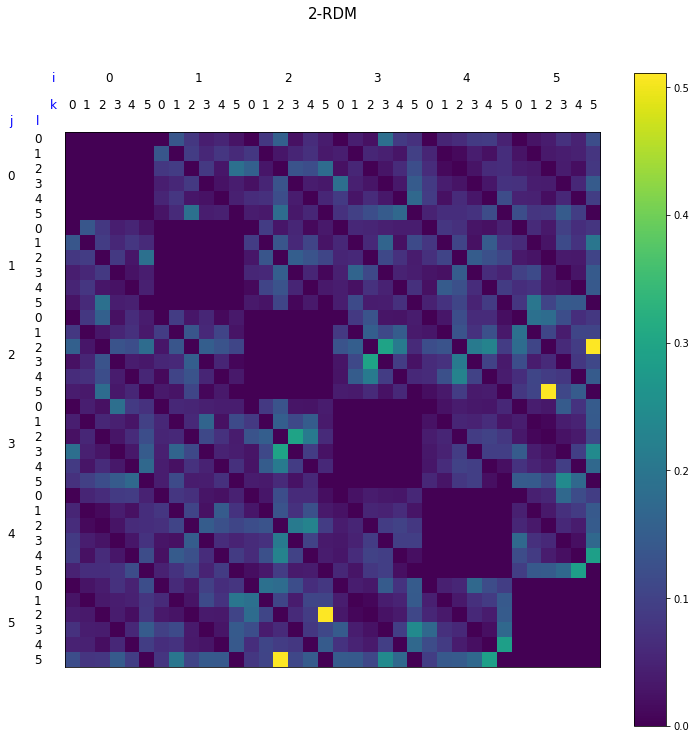
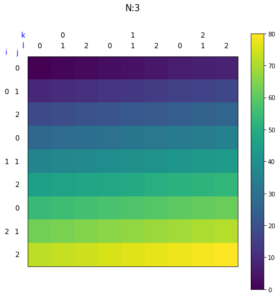
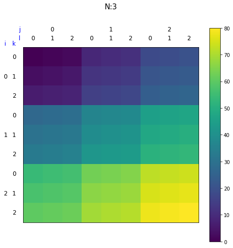

# fastwedge

縮約密度行列とwedge積の高速な計算を行います。

<p align="center">
  </img>  
</p>

- [fastwedge](#fastwedge)
  - [Installation](#installation)
  - [Usage](#usage)
    - [visTensor](#vistensor)
    - [vis4dTensorNest](#vis4dtensornest)
    - [fast\_compute\_k\_rdm](#fast_compute_k_rdm)
    - [fast\_wedge](#fast_wedge)
    - [fast\_wedge\_topM](#fast_wedge_topm)
    - [test](#test)
- [LICENSE](#license)


## Installation

Google Colab上での利用を主に想定しています。

```python
!pip install openfermion
!pip install git+https://github.com/hari64boli64/fastwedge.git
```

## Usage

### visTensor

$2,4,6,8$次元のテンソルのビジュアライズを行います。

$2n$ 次元のテンソルに対して、 $1,2,...,n$ 番目のindexを上側に、 $n+1,n+2,...,2n$ 番目のindexを左側に並べています。

以下に実行例を載せます。

```python
import fastwedge
import numpy as np

tensor = np.resize(np.arange(3**4), (3, 3, 3, 3))
fastwedge.visTensor(tensor)
```



### vis4dTensorNest

$4$ 次元のテンソルのビジュアライズを入れ子状にして行います。

$4$ 次元のテンソルに対して、それを $2$ 次元配列の各要素が $2$ 次元配列であると捉え、 $1,2$ 番目のindexを上側と左側に並べた後、各要素毎に対して $3,4$ 番目のindexを再び上側と左側に並べています。

以下に実行例を載せます。

```python
import fastwedge
import numpy as np

tensor = np.resize(np.arange(3**4), (3, 3, 3, 3))
fastwedge.vis4dTensorNest(tensor)
```




### fast_compute_k_rdm

k-RDMを高速に計算します。

フェルミオン系の量子多体状態 $\rho$ に対して、その $k$ -RDM (Reduced Density Matrix, 縮約密度行列)の行列要素を

$$
\begin{align*}
    ^k D^{p_1 \cdots p_k}_{q_1 \cdots q_k} = \mathrm{Tr}[c_{p_1}^\dagger \cdots c_{p_k}^\dagger c_{q_1} \cdots c_{q_k} \rho]
\end{align*}
$$

により定義します。ここで、 $c_i^{(\dagger)}$ は $i$ 番目のフェルミオンに関する消滅(生成)演算子を表します。

この計算結果で返ってくるテンソルは、例えば $k=2$ の場合、以下の要請を満たします。

```python
import fastwedge
import numpy as np
import openfermion

k = 2
n_qubits = 5
vec = np.random.normal(size=2**n_qubits)

fast_k_rdm = fastwedge.fast_compute_k_rdm(k, vec)

assert np.isclose(
    fast_k_rdm[1][2][3][4],
    vec.conj() @
    openfermion.get_sparse_operator(
        openfermion.FermionOperator(f"{1}^ {2}^ {3} {4}"),
        n_qubits).toarray() @
    vec
)
```

### fast_wedge

wedge積を高速に計算します。

Wedge積の定義は、以下のように与えられます。

$$
    \left( a \wedge b\right)
     ^{i_{1}, i_{2}, ..., i_{p},..., i_{p+q}}
     _{j_{1}, j_{2}, ...,j_{p}, ..., j_{p+q} } =
    \left(\frac{1}{N!}\right)^{2}
    \sum_{\pi, \sigma}\epsilon(\pi)\epsilon(\sigma)
    a_{\pi(j_{1}), \pi(j_{2}), ..., \pi(j_{p}) }
     ^{ \sigma(i_{1}), \sigma(i_{2}), ..., \sigma(i_{p})}
    b_{\pi(j_{p+1}), \pi(j_{p+2}), ..., \pi(j_{p+q}) }
     ^{ \sigma(i_{p+1}), \sigma(i_{p+2}), ..., \sigma(i_{p+q})}
$$

ただし、 $a$ と $b$ はそれぞれ $p$ -RDM、 $q$ -RDMを表すテンソルで、フェルミオンの半交換関係に起因して行列要素同士が符号で結びついています。

また、 $\pi, \sigma$ はそれぞれ $(p+q)$ 個の添字に関する巡回を表し、 $\epsilon(\pi)$ などは巡回操作の符号を表すものとします。

その素朴なeinsumによる`wedge`関数の実装は、googleの提供する[Openfermionライブラリ](https://quantumai.google/reference/python/openfermion/linalg/wedge)に提供されています。

この計算結果で返ってくるテンソルは、例えば $k=2$ の場合、以下の要請を満たします。

```python
import fastwedge
import numpy as np
import openfermion

Q, p, q = 5, 1, 2
left_tensor = np.random.random(tuple(Q for _ in range(2*p)))\
    + 1j*np.random.random(tuple(Q for _ in range(2*p)))
right_tensor = np.random.random(tuple(Q for _ in range(2*q)))\
    + 1j*np.random.random(tuple(Q for _ in range(2*q)))
left_index_ranks = (p, p)
right_index_ranks = (q, q)

fast_ans = fastwedge.fast_wedge(left_tensor, right_tensor,
                                left_index_ranks, right_index_ranks),
slow_ans = openfermion.wedge(left_tensor, right_tensor,
                             left_index_ranks, right_index_ranks)

assert(np.allclose(fast_ans, slow_ans))
```

ただし、以下の事に十分注意して下さい。

例として、 $a,b,p,q,N,Q$ を以下の様に定義します。

$$
\begin{align}
    &a_0^0=1,a_1^0=2,a_0^1=3,a_1^1=4 \\
    &b_0^0=1,b_1^0=2,b_0^1=3,b_1^1=4 \\
    &p=1,q=1,N=2,Q=2
\end{align}
$$

この時、

$$
      (a \wedge b)^{0, 1}_{0, 1}
$$

$$
    = \left(\frac{1}{N!}\right)^{2}
        \sum_{\pi, \sigma}\epsilon(\pi)\epsilon(\sigma)
        a_{\pi(0)}^{\sigma(0)}b_{\pi(1)}^{\sigma(1)}
$$

$$
    = \frac{1}{4} ((1 * 1 * a_{0}^{0} b_{1}^{1})+(-1 * 1 * a_{1}^{0} b_{0}^{1})
                    +(1 * -1 * a_{0}^{1} b_{1}^{0})+(-1 * -1 * a_{1}^{1} b_{0}^{0}))
$$

$$
    = \frac{1}{4} ((1 * 1 *1 * 4)+(-1 * 1 * 2 * 3)
                    +(1 * -1 * 3 * 2)+(-1 * -1 * 4 * 1))
$$

$$
    = -1
$$

と`-1`ですが、以下のコードは、`-1`でなく、`example_tensor[0,1,0,1]=(1+0j)`と`1`を返します。

```python
example_a = np.array([[1, 2], [3, 4]])
example_b = np.array([[1, 2], [3, 4]])
example_tensor = wedge(example_a, example_b, (1, 1), (1, 1))
print(f"{example_tensor[0,1,0,1]=}")
```

これは、

$$
    tensor[0,1,0,1]=(a \wedge b)^{0, 1}_{1, 0}
$$

と、openfermionの仕様として`<a^ b^ c d> = D_{dc}^{ab}`である事に基づいています。

### fast_wedge_topM

(更新中)

### test

単体テストを行う関数です。上記で述べた要請を満たしているかをチェックしています。

開発時以外に使う必要はありません。

Github Actionsを用いて実行しています。

# LICENSE

Open Sourceです。

[](LICENSE)
